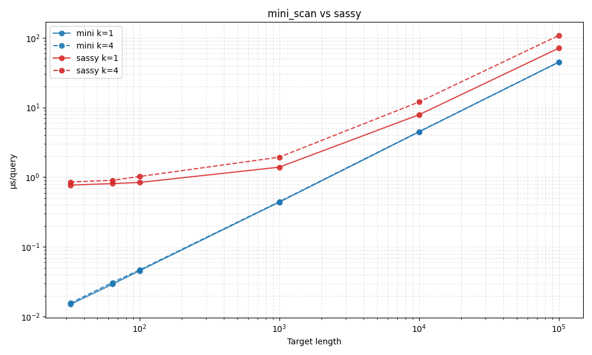

### 🤏 Mini Myers
SIMD Myers implementation to "check" whether "batches" of short patterns (<=64nt) are present in a longer 
text with at most `k` edits.

Mainly for [Barbell](https://github.com/rickbeeloo/barbell) as a faster pre-filter (2x) before running [sassy](https://github.com/RagnarGrootKoerkamp/sassy/).
Most likely you are looking for [sassy](https://github.com/RagnarGrootKoerkamp/sassy/) instead, unless you want to batch search short patterns.

---

### When to use
- Short queries (`<=16` for U16 backend, `<=32` for U32 backend, `<=64` for U64 backend)
- Search for multiple queries (at least 8 or so)

--- 

#### How to use:


#### Basic usage
This will return boolean results indicating whether each query matches (within `k` edits). 


```rust
use mini_myers::{Searcher, TQueries};
use mini_myers::backend::{U32, U64};

// Create a searcher with U32 backend (alpha=None means alpha=1.0, no overhang reduction)
// that is 8 queries in parallel (8*32)
let mut searcher = Searcher::<U32>::new(None);
let queries = vec![b"ATG".to_vec(), b"TTG".to_vec()];
let encoded = TQueries::<U32>::new(&queries, false); //true = also search rc
let target = b"CCCTCGCCCCCCATGCCCCC";

// Scan mode: get boolean results indicating if each query matches (within k edits)
let results = searcher.scan(&encoded, target, 4);
assert!(results[0]); // "ATG" matches
assert!(!results[1]); // "TTG" doesn't match

// Use U64 backend for longer queries (up to 64 nucleotides)
// that is 4 queries in parallel (4*64)
let mut searcher64 = Searcher::<U64>::new(None);
let encoded = TQueries::<U64>::new(&queries, false);
let results = searcher64.scan(&encoded, target, 4);
```


#### With "overhang" enabled
Like in [sassy](https://github.com/RagnarGrootKoerkamp/sassy/) `mini_myers` can apply 
a reduced penalty for characters "hanging over" the target sequence, i.e.:
```
    q: AAACCC
          |||
    t:    CCCGGGGGGGGGGGGGG
```
You can enable overhang by passing `Some(overhang_cost)` to `Searcher::new()`, i.e. `Some(0.5)`:
```rust
let mut searcher = Searcher::<U32>::new(Some(0.5));
let results = searcher.scan(&encoded, target, 4);
```
In the example above, this would give a cost of `3 * 0.5 = 1.5`


---

#### Little bench
Note that `mini_myers` and `sassy` are not directly comparable. 
The `mini_myers` "scan" mode just returns whether a match is present `<=k`, whereas sassy 
finds the positions and performs traceback (of course much more compute).

Search for 96 queries at k=[1,4] in a range of targets (x-axis)




Run the bench using `cargo bench --bench sassy`. 


#### Some dev stuff
see `justfile`, to get assembly for `scan`, disable inline `#[inline(never)]` and run `just search_asm`. To enable all permissions for flamegraph/perf `just perm`.